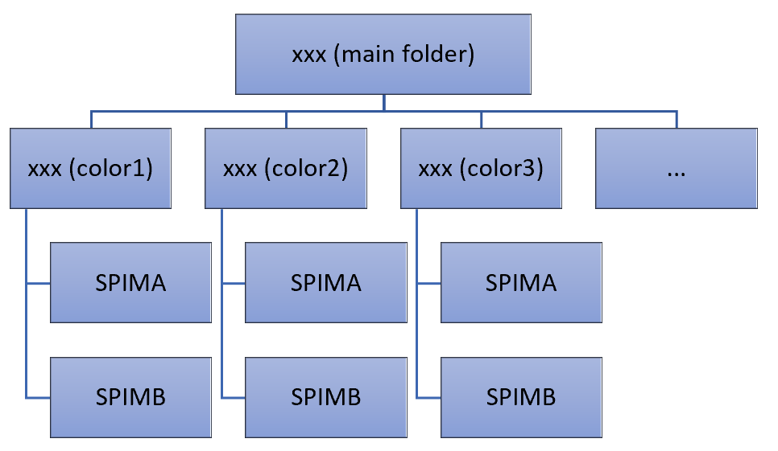

User Manual for diSPIMFusion
==============

## Overview

The [**diSPIMFusion**](https://www.dropbox.com/sh/czn4kwzwcgy0s3x/AADipfEsUSwuCsEBg8P7wc4_a?dl=0) (ImageJ macro-based) is a portable software package that performs registration and joint deconvolution on the two view images acquired by diSPIM microscope. The software package contains an ImageJ macro `diSPIMFusion_UI.ijm`, several CUDA/C++ executable applications, and PSFs for the diSPIM microscope. Basically, the ImageJ macro creates a user interface for parameter configuration and calls the executable applications which complete all the processing based on GPU device. 

**System Requirements**. To run the software, the PC needs to have:

1) Windows 7 or 10 operation system, 
2) Either Fiji or ImageJ
3) A graphics card supported by CUDA 10. Most nowadays graphics card from Nvidia should be compatible with CUDA 10, but better [check here](https://developer.nvidia.com/cuda-gpus). 
4) An appropriate driver for the graphics card. A default driver, especially an old version, may be enough for the GPU card working for monitor display, but it is possible that the GPU card can’t be recognized by the CUDA program. Usually, [a later driver from NVIDIA](http://www.nvidia.com/Download/index.aspx) should support the GPU cards to do parallelized computation.

**GPU Memory Requirement**. The software runs fast based on parallelized computation by GPU card, but the images size is limited by the GPU memory. To run the software, the GPU memory should be > 8.5 times of the image size (16-bit, after interpolation). Specifically:
- if the GPU memory > 24 times of image size, the processing runs in a most efficient way; Otherwise,
- if the GPU memory > 8.5 times of image size, the processing runs slower as a tradeoff of efficiency and memory usage.

## How to install the program

- **Step 1**, copy the folder `.\diSPIMFusion` to Fiji or ImageJ’s main folder (e.g, C:\Fiji.app\).

- **Step 2**, install the UI macro: 

    Fiji (or ImageJ) `Plugins` --> `Macros` --> `Install...`, Choose the macro file `diSPIMFusion_UI.ijm` (within the `.\diSPIMFusion` folder). Then there will be a dispimfusion option listed on the `Plugins` --> `Macros` menu.

## How to run the program

- **Step 1. run the ImageJ macro**:

    Fiji (or ImageJ) `Plugins` --> `Macros` --> `dispimfusion`. Or,

    Directly open the macro `diSPIMFusion_UI.ijm` within Fiji (or ImageJ) and run it;

- **Step 2. Choose `Single color` or `Multiple colors` option when the pop-up dialog shows up**.

    
    <div align="center">
    
    </div>
    
    <div align="center">
    Fig. 1, pop-up window for color option.
    </div>
    
- **Step 3. Following the pop-up dialogs, sequentially select folders**:
    
    - **For single color**: SPIMA folder --> SPIMB folder --> Output folder.

        <div align="center">
        
        </div>
        
        <div align="center">
        Fig.2, pop-up dialog windows for selecting folder in single color case.
        </div>

    - **For multiple colors**: Main folder --> Output folder. 

        Users need to organize the input data as shown in Fig. 3. The program automatically takes each subfolder within the main folder as the input of each color.
        
        <div align="center">
        
        </div>
        
        <div align="center">
        Fig. 3, folder convention of multiple colors data. The “xxx ( )” indicates the name for the folders.
        </div>

- **Step 4. Confirm and modify the parameters in the next pop-up panel**.

    The panel contains all parameters that are needed for the executable apps. Users can modify any of the parameters at this step. The panel along with the explanations for the parameters are shown in Fig. 4.

    <div align="center">
    
    </div>
    
    <div align="center">
    Fig. 4, the diSPIMFusion GUI.
    </div>

- **Step 5 (optional). Specify input matrix file**.

    If `Customized` is selected as initial matrix, users will be guided to choose a matrix file. (A text file is provided within the test data.)

    <div align="center">
    
    </div>
    
    <div align="center">
    Fig. 5, dialog for choosing matrix file.
    </div>

- **Step 6. GUP-based apps running**.

    Then the macro calls executable applications and starts the processing. Once the processing is completed, all messages will show up in the ImageJ log window.

    <div align="center">
    
    </div>
    
    <div align="center">
    Fig. 6, an example of the ImageJ log window.
    </div>

- **Step 7. Output files and folders**.

    **`Decon`**: deonvolved imges and corresponding 2D/3D maximum intensity projections. 

    **`RegA or RegB`**: registered images (only if the `Save Reg SPIMA` and/or `Save Reg SPIMB` option is checked). 

    **`TMX`**: transformation matrixes of each registration.

    <div align="center">
    
    </div>

    <div align="center">
    Fig. 7, output files and folders.
    </div>

## Additional notes and tips

1) If it is the first time for the GPU device to run on the computer, it may take some time (usually less than 5 minutes) to initialize the device. Once the device is initialized, it won’t need initialization next time, even after the computer is restarted. 
2) Once the CUDA app has been launched by the ImageJ macro, its running is independent on the Fiji or ImageJ anymore. But its running status will be shown as `spimFusionBatch.exe` in system Task Manager, you can kill it there if needed.

    <div align="center">
    
    </div>
    
    <div align="center">
    Fig. 8, CUDA app status in Task Manager.
    </div>

3) Users could customize the default parameters by modifying the codes in the ImageJ macro `diSPIMFusion_UI.ijm` as shown in Fig. 9. 

    <div align="center">
    
    </div>
    
    <div align="center">
    Fig. 9, parameters customization in ImageJ macro.
    </div>

4) When doing the fusion, since the x size in view A will need to match the z size in view B, it is suggested to make the x size comparable with z size (physical size in sample) when we acquire the data, or do a cropping to remove the redundant in x size or z size.

5) It is recommended to make the raw images compact, e.g., try to do cropping to appropriately remove the empty content at the image boundaries, before running the diSPIMFusion program. And if we do want to do a cropping, it is better to make the information content centered in the image as the views are aligned at center.

6) In some cases, it may not be feasible to guarantee success for every dataset. In these cases, we may need additional efforts:

    - get a good registration based on certain good images and apply to other time point images.
    - for multi-color datasets, use one color to get good registration and apply to the failure case.
    - use other registration algorithms such as landmark based methods.


7) **A bug** in diSPIMFusion ImageJ macro-based version

    After running `diSPIMFusion_UI.ijm`, the app `spimFusionBatch.exe` gets idle after processing a few time points on certain diSPIM datasets. E.g., Fig. 10 shows the `ProcessingLog.txt` contents when the app gets stuck at 5th time points (sometimes at the 1st time points) in processing a highNA diSPIM dataset:

    <div align="center">
    
    </div>
    
    <div align="center">
    Fig. 10, the CUDA app gets idle during the processing on the 5th time point images.
    </div>
 
    The bug corresponds to the source code in [spim_fusion_batch.cpp](./src/spim_fusion_batch.cpp) at 
    ```posh
    readtifstack(h_img2In, fileImg2, &tempSize[0]);
    ``` 
    This is probably caused by any confliction between Fiji (ImageJ) and the `spimFusionBatch.exe` on file I/O.

    **Temporary solutions:**

    - run `diSPIMFusion_UI.ijm`, if the processing gets stuck, close Fiji, then `spimFusionBatch.exe` resumes running.
    - use command line, e.g. `cmd_spimFusionBatch.bat`, to run to batch processing instead of ImageJ macro-based version.


